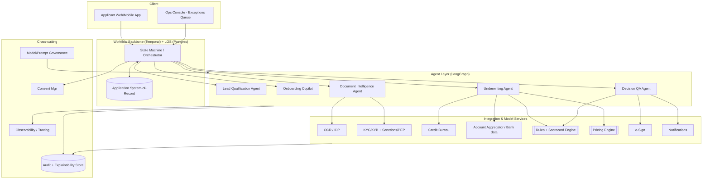
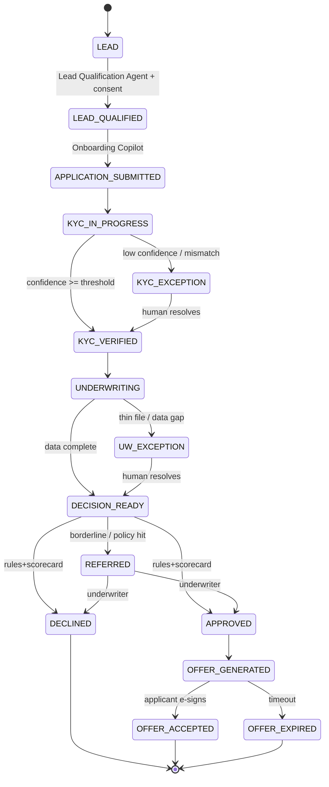
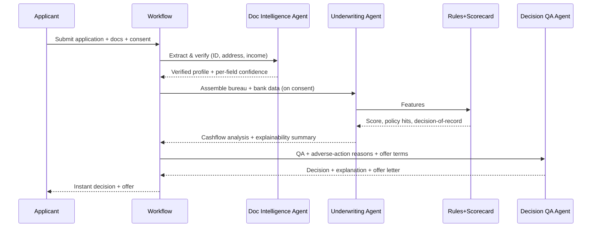

# AI-Native Lending Platform — MVP Design Document

**Status:** Draft for discussion
**Owner:** _[you]_ · **Reviewers:** Eng leads, Risk/Policy
**Source:** "AI-Native Lending MVP Flow: Steps 2–6" roadmap
**Version:** 0.2

> **v0.2 note:** A design-review (grilling) session resolved twelve load-bearing questions. Each is recorded in **§16 — Design Review Decisions**, with the problem and the agreed resolution. Where a decision changes an earlier section, §16 names the affected section; the inline sections above still reflect v0.1 wording and should be read together with §16, which takes precedence on any conflict.

---

## 0. How to read this doc

This is the design for a *working* MVP — a thin, end-to-end vertical slice of the five-stage flow in the roadmap (Acquisition → Onboarding → KYC → Credit Assessment → Approval & Offer). It is deliberately scoped so the full pipeline runs for a clean applicant and degrades gracefully to a human queue for everything else. It is **not** a production lending platform; Section 14 lists what is intentionally deferred.

### Assumptions (please correct any of these)

| # | Assumption | Why it matters | If wrong… |
|---|---|---|---|
| A1 | **Geography: India.** Account Aggregator (AA), credit bureau (e.g. CIBIL), DigiLocker-style eKYC, sanctions/PEP. | Determines every integration and KYC rule. | Swap the integration adapters; architecture is unchanged. |
| A2 | **One product for the MVP: an unsecured personal/consumer loan, small ticket.** | Minimises integrations (no KYB/business registries in the critical path). | If SME, add a KYB sub-flow in Step 4 and business cashflow in Step 5 — additive, not structural. |
| A3 | **Greenfield.** We build a minimal Loan Origination System (LOS) rather than integrate a legacy core. | Lets us own the state model. | If integrating an existing LOS, it becomes the system-of-record and our workflow engine orchestrates it. |
| A4 | **Target: a credible POC heading toward a limited pilot** with real applicants behind a feature flag. | Sets the quality bar (auditability required, scale not). | A pure internal demo could cut some cross-cutting work. |
| A5 | **Small senior team, ~12 weeks.** | Drives phasing and "buy not build" choices. | Re-phase Section 11. |

---

## 1. Overview, goals, non-goals

### 1.1 What we're building
An agentic origination pipeline that takes an applicant from **lead** to a **priced, explainable credit decision and offer**, fully automated on clean cases, with low-confidence cases routed to a human reviewer. Each stage is decomposed into the three layers from the roadmap: **business workflow**, **AI/agentic layer**, and **systems/outputs**.

### 1.2 Goals
- A single application can travel lead → offer with **no human touch on the happy path**.
- Any step can **escalate to a human** with full context when confidence is low.
- Every decision is **reconstructable and explainable** (inputs, rules fired, model version, agent reasoning, reviewer).
- The credit decision of record is **deterministic and auditable** — never produced by an LLM (see §2.1).

### 1.3 Non-goals (MVP)
- Disbursement, loan servicing, collections, repayments.
- Multiple products, multiple geographies, or co-applicants/guarantors.
- A trained ML risk model (we start with an expert/rules-based scorecard; §6.6).
- High scale / HA. Single-region, modest throughput is fine.

### 1.4 Success metrics (these are the demo KPIs too)
| Metric | MVP target | Maps to roadmap value |
|---|---|---|
| Straight-through processing (STP) rate on clean cases | ≥ 80% | Straight-through onboarding |
| Median time-to-decision (clean case) | < 90 seconds | Instant decisioning |
| Document field extraction precision (key fields) | ≥ 95% | Real-time verification |
| % decisions with a complete, human-readable explanation + adverse-action reasons | 100% | Explainable underwriting |
| Exception handling: low-confidence cases correctly routed (not auto-decided) | 100% | Trust / compliance |

---

## 2. Key design principles

### 2.1 The LLM never makes the binding credit decision
This is the load-bearing principle. The approve/decline/refer of record comes from a **deterministic policy + scorecard engine** whose output is reproducible and defensible to a regulator. The "Underwriting Agent" and "Decision QA Agent" *orchestrate data pulls, interpret results in plain language, generate adverse-action reasons, and assist underwriters* — they do not decide. Getting this wrong creates an un-auditable, non-compliant system; getting it right gives us AI-native speed **with** explainability.

### 2.2 Thin vertical slice over broad coverage
We build the spine first and one product deep, not five agents wide. Breadth is a fast-follow once the slice is proven.

### 2.3 Every agent is a bounded, schema-constrained, evaluable component
No agent emits free text where a field is expected. Every agent has: a fixed tool set, a strict output schema, a confidence threshold, an escalation path, and a golden eval set (§7).

### 2.4 Consent gates data
No bureau/AA/KYC pull happens without an explicit, logged consent artifact captured at acquisition (§9.2).

---

## 3. High-level architecture

Four planes:

1. **Workflow backbone** — a durable, event-driven state machine (the spine). Owns application state and orchestrates long-running, async steps and human waits.
2. **Agent layer** — each roadmap agent invoked as a workflow step: an LLM reasoning loop + tools + output schema + threshold + escalation.
3. **Integration & model services** — adapters (bureau, AA, KYC, OCR/IDP, sanctions/PEP, e-sign, notifications) + the deterministic rules engine, scorecard, and pricing engine.
4. **Cross-cutting plane** — consent, audit trail, explainability store, model/prompt governance, security, observability, eval harness.



---

## 4. End-to-end flow (state machine)

The LOS holds one record per application; the workflow engine drives it through these states. Anything that can't be auto-resolved goes to `*_EXCEPTION` and lands in the ops queue, then returns to the flow.



### Happy-path sequence (clean applicant)



---

## 5. Canonical data model

A single application aggregate the agents read from and write to. Agents only write their own namespaced section plus a confidence map.

```json
{
  "application_id": "uuid",
  "product": "personal_loan",
  "state": "UNDERWRITING",
  "created_at": "iso8601",
  "consent": {
    "bureau": {"granted": true, "artifact_id": "...", "ts": "..."},
    "account_aggregator": {"granted": true, "artifact_id": "...", "ts": "..."}
  },
  "applicant": {
    "name": null, "dob": null, "pan": null, "address": null,
    "requested_amount": 200000, "tenure_months": 24, "purpose": "..."
  },
  "kyc": {
    "id_verified": null, "address_verified": null,
    "sanctions_pep_hit": null, "risk_flags": [],
    "field_confidence": {"name": 0.99, "pan": 0.97, "address": 0.62}
  },
  "credit": {
    "bureau_score": null, "obligations": null,
    "cashflow": {"avg_inflow": null, "volatility": null, "bounce_count": null},
    "scorecard_output": {"score": null, "band": null, "policy_hits": []}
  },
  "decision": {
    "outcome": null,                // APPROVED | DECLINED | REFERRED
    "engine_version": null,
    "adverse_action_reasons": [],
    "explanation": null,
    "offer": {"amount": null, "rate": null, "tenure": null, "emi": null}
  },
  "audit_ref": "audit-stream-id",
  "current_owner": "system | ops:user_id"
}
```

Each stage produces the **output artifact** named in the roadmap (qualified lead → submitted application → verified profile → scorecard/recommendation → decision/offer letter), persisted and linked to the audit stream.

---

## 6. Component design

### 6.1 Workflow backbone
- **Engine:** Temporal. Chosen because steps are long-running and async (waiting on a KYC provider, a bureau pull, a human reviewer), and we need durability, retries, and timeouts for free. Human reviews are modeled as Temporal **signals** — the workflow parks at `*_EXCEPTION` until the ops console sends a resolution.
- **LOS:** Postgres as system-of-record for the application aggregate; object storage (S3-compatible) for documents and generated artifacts.
- **Events:** state transitions emit events for observability and the audit store.

### 6.2 Agent layer
- **Orchestration:** LangGraph per agent (explicit graph of reason → call tool → validate → decide/escalate). Backend in **Python/FastAPI** (natural for ML + agent tooling).
- **LLM:** Claude via the Anthropic API for reasoning, extraction normalization, and explanation generation. Prompts and model versions are governed (§9.4).
- Each agent conforms to the spec template in §7.

### 6.3 Integration services (adapters)
Thin, swappable adapters with a common interface, each with a **sandbox/mock mode** so the pipeline runs end-to-end before real provider onboarding completes:
- **OCR/IDP** — document text + structured fields.
- **KYC/KYB + Sanctions/PEP** — identity/address verification, screening.
- **Credit Bureau** — score + obligations (on consent).
- **Account Aggregator** — bank statement / cashflow data (on consent).
- **e-Sign**, **Notifications** (email/SMS/WhatsApp).

> Provider sandbox availability and AA onboarding timelines are the real schedule risk — see §13.

### 6.4 Rules engine (deterministic)
Config-driven decision tables (hard knockouts → policy checks → band assignment). Versioned. Output: `pass/fail` per rule + list of `policy_hits`. This + the scorecard is the **decision of record**.

### 6.5 Scorecard
MVP: an **expert/heuristic scorecard** (weighted factors: bureau score, DTI, cashflow stability, bounce count) producing a score and risk band. Designed so a trained ML model can drop in behind the same interface later — no architectural change. **Owned by the credit/risk SME.**

### 6.6 Pricing engine
Maps risk band + product policy → rate, eligible amount, tenure, EMI. Config-driven; versioned alongside the scorecard.

### 6.7 Ops console (exceptions queue)
React app for reviewers: shows the parked application, the agent's reasoning, the low-confidence fields/flags, source documents, and resolve/override actions (which signal the workflow). Every override is audited with reviewer identity and reason.

---

## 7. Agent specification (template + the five agents)

Every agent defines the same five things — this is the boundary between a reliable agentic system and a brittle demo:

1. **Tools** — the exact APIs it may call, and nothing more.
2. **Output schema** — strict, validated; reject and retry on schema violation.
3. **Confidence + thresholds** — every extraction/recommendation carries confidence; below threshold → human.
4. **Escalation path** — what state it parks in and what context the reviewer sees.
5. **Eval set** — a golden, labelled dataset to measure quality and catch regressions.

| Agent | Step | Tools | Key output | Auto vs escalate |
|---|---|---|---|---|
| **Lead Qualification** | 2 | product catalog, eligibility pre-check, consent capture | qualified lead, next-best-action, channel attribution | low intent → nurture; ineligible → decline early |
| **Onboarding Copilot** | 3 | form autofill (from lead/eKYC), checklist generator, multilingual assist | complete submitted application | missing/invalid docs → prompt applicant |
| **Document Intelligence** | 4 | OCR/IDP, field validators, KYC/sanctions screening | verified profile, risk flags, per-field confidence | any key field < threshold or mismatch → `KYC_EXCEPTION` |
| **Underwriting** | 5 | bureau pull, AA/cashflow pull, **rules+scorecard (read-only)** | cashflow analysis, scorecard interpretation, **explainability summary** | thin file / data gap → `UW_EXCEPTION` |
| **Decision QA** | 6 | rules engine (read), pricing engine, offer-letter generator, notifications | decision, **adverse-action reasons**, personalized offer, underwriter copilot on referrals | borderline / policy hit → `REFERRED` |

> Note the Underwriting and Decision QA agents call the rules/scorecard engine **read-only** — they interpret and explain, they do not decide (§2.1).

---

## 8. Human-in-the-loop & exceptions
- A unified **exceptions queue** is the single mechanism for trust. Three entry points: `KYC_EXCEPTION`, `UW_EXCEPTION`, `REFERRED`.
- The workflow parks (durably, indefinitely) until a reviewer resolves via the ops console; resolution is a signal that resumes the workflow.
- Reviewers always see: the agent's reasoning, the specific low-confidence items, source evidence, and the allowed actions. Overrides are first-class audited events.

---

## 9. Cross-cutting concerns

### 9.1 Audit trail & explainability
Append-only audit stream per application: every input, tool call, model+prompt version, rule fired, agent reasoning, and human action. The **explanation and adverse-action reasons are stored alongside the decision** so it is reproducible later. This is a build-from-day-one requirement, not a phase.

### 9.2 Consent & privacy
Explicit consent artifacts captured at Step 2 gate every downstream pull (bureau, AA, KYC). Consent state lives on the application and is checked before each adapter call; absence blocks the call.

### 9.3 Security
PII encrypted at rest and in transit; documents in access-controlled object storage; per-adapter scoped credentials in a secrets manager; least-privilege access to the ops console.

### 9.4 Model & policy governance
Version and pin: LLM model IDs, prompts, rules config, scorecard, pricing config. Every decision records which versions produced it, so a decision is always reproducible.

### 9.5 Observability
Distributed tracing across agents per application; dashboards for the §1.4 KPIs (STP rate, exception rate, time-to-decision, extraction precision).

---

## 10. Tech stack summary

| Concern | Choice | Rationale |
|---|---|---|
| Language/runtime | Python 3.11 + FastAPI | Best fit for ML/agent tooling. |
| Workflow engine | Temporal | Durable, async, long-running, human-in-loop via signals. |
| Agent orchestration | LangGraph | Explicit, debuggable agent graphs. |
| LLM | Claude (Anthropic API) | Reasoning, extraction normalization, explanations. |
| System-of-record | PostgreSQL | Relational app aggregate; `pgvector` if policy retrieval is needed. |
| Object storage | S3-compatible | Documents + generated artifacts. |
| Frontend | React | Applicant flow + ops console. |
| Rules/scorecard/pricing | Config-driven, versioned | Deterministic, auditable, SME-owned. |
| Integrations | Adapter pattern w/ mock mode | Build end-to-end before provider sandboxes land. |

> Substitute managed equivalents per your cloud; nothing here is cloud-specific.

---

## 11. Phased delivery plan (~12 weeks)

Sequenced by **risk and demo value**, not step number: build the spine, then the highest-differentiation AI (documents, underwriting), then the customer-facing copilots.

| Phase | Weeks | Deliverable | Exit criteria |
|---|---|---|---|
| **0 — Foundations** | 1–2 | Workflow engine, minimal LOS, audit store, data model, schemas, observability scaffold, adapter mock mode | A dummy app persists and emits audited state transitions. |
| **1 — Backbone happy path** | 2–3 | App moves submitted → hard-coded decision → offer letter; exceptions queue works | A clean dummy app reaches `OFFER_GENERATED`; an exception parks and a human resumes it. |
| **2 — Document Intelligence + KYC** *(highest-risk AI)* | 4–6 | Doc Intelligence Agent + KYC/sanctions orchestration, per-field confidence, `KYC_EXCEPTION` | Extraction precision ≥ 95% on golden set; low-confidence routes to queue. |
| **3 — Underwriting** | 6–8 | Bureau + AA pulls, deterministic scorecard+rules, cashflow analysis, explainability summary | Decision-of-record reproducible; explanation generated for every case. |
| **4 — Decisioning + Offer** | 8–10 | Decision engine, adverse-action reasons, pricing, offer letter, notifications, SLA metrics | Clean case runs lead→offer < 90s; 100% have adverse-action reasons. |
| **5 — Acquisition + Onboarding copilots** | 10–12 | Lead Qualification Agent, Onboarding Copilot (autofill, checklist, multilingual) | Conversion polish for demo; copilots layer onto working pipeline. |

**Demo target:** one clean application going lead-to-offer in under a minute, then a deliberately messy one (blurry doc / thin file) dropping gracefully to the human queue — showing both the automation *and* the trust model.

---

## 12. Key API surface (illustrative)

```
POST /applications                      # create (from qualified lead)
POST /applications/{id}/documents       # upload docs
POST /applications/{id}/consent         # record consent artifact
GET  /applications/{id}                 # full aggregate + state
GET  /applications/{id}/explanation     # decision explanation + adverse-action reasons
GET  /ops/queue                         # exceptions queue
POST /ops/applications/{id}/resolve     # reviewer resolution -> workflow signal
```

---

## 13. Risks & mitigations

| Risk | Impact | Mitigation |
|---|---|---|
| Provider sandbox / AA onboarding delays | Blocks end-to-end testing | Adapter **mock mode** from Phase 0; integrate real providers in parallel. |
| LLM leaks into the binding decision | Compliance / un-auditable | Hard architectural boundary: rules+scorecard decide; agents read-only (§2.1). |
| Document extraction errors auto-approve bad cases | Credit/regulatory loss | Per-field confidence + thresholds + exceptions queue; eval set gates releases. |
| Missing adverse-action reasons | Regulatory exposure | 100% coverage is an exit criterion (Phase 4); generated and stored with decision. |
| Scorecard quality | Wrong decisions | Owned by the risk/policy function; start expert/rules-based, swap ML behind same interface later. |
| Scope creep to SME / multi-product | Slips timeline | Lock single vertical slice (A2); breadth is a fast-follow. |

---

## 14. Out of scope / future
Disbursement & servicing; collections; trained ML risk model; SME/KYB flow; co-applicants; multi-product & multi-geo; high availability and scale; fraud-network analytics. The architecture is designed so each is **additive** (new adapter, new agent, new scorecard) rather than a rebuild.

---

## 15. Open questions
1. Confirm the **single MVP product** and segment (consumer vs SME). 
2. **Geography** and therefore the exact bureau / AA / KYC providers and their sandbox access.
3. **Greenfield vs integrate** an existing LOS/core.
4. Risk appetite for the pilot: auto-approve band vs refer-everything-borderline.
5. Demo vs pilot timeline and the **feature-flag** plan for first real applicants.

---

## 16. Design Review Decisions

This section records the questions raised in a design-review (grilling) session and the resolution agreed for each. Format per item: **Problem** (what was soft or wrong), **Decision** (what we agreed), **Affects** (sections to update). On any conflict with the v0.1 body above, this section takes precedence.

### 16.1 — Q1: Adverse-action reasons must be deterministic, not LLM-authored

**Problem.** §2.1 correctly keeps the *binding decision* deterministic, but §7 hands the Decision QA Agent the job of *generating* adverse-action reasons — the legally-required statement of *why* an applicant was declined. An adverse-action reason is a legal representation of the decision. If the LLM authors it freely, it can drop, add, reorder, or soften reasons relative to what actually fired — an un-auditable gap between the decision of record and the *reason* of record. That is the same compliance risk §2.1 exists to close, moved one box downstream.

**Decision.** The LLM may choose the **words**, never the **reasons**. The rules engine emits `policy_hits`, each carrying a stable `reason_code`; that set *is* the adverse-action record. The agent is handed exactly those codes and renders prose for each — it cannot introduce a reason that did not fire or omit one that did. A cheap deterministic post-check asserts the rendered output covers the fired code set and only that set (reject-and-retry on mismatch, same pattern as schema validation in §2.3). The freer-reasoning exception is the **underwriter copilot on referrals**, where a human owns the final call — LLM-advising-a-human is a lower risk class than LLM-authoring-a-customer-notice.

**Affects.** §7 (Decision QA: "renders" not "generates", + faithfulness check); §2.1 (state the reason-code boundary explicitly).

### 16.2 — Q2: Report overall automation rate over a documented input mix, gated by a confusion matrix

**Problem.** §1.4's headline "STP ≥ 80% on clean cases" is near-circular — a "clean case" is defined by going straight through — so it says little about how much of the real funnel is automated, and it hides the dangerous outcomes.

**Decision.** Report **overall automation rate** = auto-decided ÷ all-submitted, against a **documented, representative input distribution** (clean / recoverable / thin-file-refer / hard-decline / fraud-flag), owned and signed off by the risk function. The honest deliverable is a **2×2 confusion matrix**, not a scalar:

|  | Auto-decided | Escalated |
|---|---|---|
| **Should automate** | ✅ STP | 💸 lost automation (safe, costs ops) |
| **Should escalate** | ☠️ **bad auto-decision** | ✅ correct routing |

The bottom-left cell — *should-escalate-but-auto-decided* — is the safety gate and must be driven to ~0, even at the cost of more cases in the lost-automation cell (over-escalating is safe; confidently auto-deciding a case you shouldn't have is not).

**Affects.** §1.4 (replace the headline metric; add the false-automation rate as a hard release gate); §7 (eval sets gain **expected-disposition** labels and a fixed mix); §9.5 (dashboards surface the matrix).

### 16.3 — Q3: Time-to-decision is a pipeline-only SLA, not end-to-end

**Problem.** §1.4 promises < 90 s while §4 pulls Account Aggregator (AA) data inline. AA is not a synchronous call — it is an async consent + data-fetch from banks that can take seconds to minutes and can fail partially — so a wall-clock end-to-end promise depends on a third party we do not control. AA integration is also not yet specified.

**Decision.** Scope the SLA to **our pipeline**: "from all required external data present → decision." Record **data-acquisition latency** as a separate, observed, non-SLA metric from day one (so a real pilot is not retrofitted under pressure). The §11 demo "lead-to-offer in under a minute" is achievable only because adapters run in **mock mode** — label it "(mock adapters)" so it is not read as a production promise. (Note: superseded in scope by 16.7 — AA leaves the MVP critical path entirely.)

**Affects.** §1.4 (redefine time-to-decision; add data-acquisition latency as observed-only); §11 (demo target gets "(mock adapters)").

### 16.4 — Q4: Confidence is a grounded signal, not LLM self-report

**Problem.** The entire trust/escalation model hinges on "confidence" (§2.3, §4, §7, and `field_confidence` in §5). If those numbers are LLM self-reported confidence, they are unreliable — models are miscalibrated and will emit high confidence on hallucinated fields — so the escalation gate has a hole exactly where it matters (confident-but-wrong extractions auto-decide → the ☠️ cell of 16.2).

**Decision.** Confidence comes from **grounded signals**, by agent:
- **Document Intelligence:** OCR/IDP engine's own per-field confidence × **cross-source agreement** (name on PAN vs bank vs form) × **deterministic format/checksum validation** (PAN checksum, pincode validity). The LLM normalizes/structures; it does not grade itself.
- **Underwriting/Decision:** "confidence" is **data completeness / rule coverage** — thin file = low data sufficiency → `UW_EXCEPTION`.
- Where an LLM judgment genuinely is the signal, **calibrate the threshold against the golden set** and measure how often "high confidence" was actually wrong.

**Affects.** §5 (annotate `field_confidence` as a derived signal); §7 (add "confidence source" as a sixth required item per agent; eval measures calibration, not just precision).

### 16.5 — Q5/Q6: Keep Temporal + LangGraph, with a pinned durability boundary

**Problem.** Temporal (§6.1) and LangGraph (§6.2) are two orchestration engines, one nested in the other. The risk is the **durability boundary**: if expensive/irreversible calls (bureau hard inquiry, AA pull, e-sign) happen *inside* the agent loop and are invisible to Temporal, a crash-then-retry can repeat them. LangGraph checkpointers *can* persist node state and resume — so the real issue is (a) running **two durability engines that must be kept consistent**, and (b) the **side-effect-vs-record gap** that *no* checkpointer closes (the external call succeeds, the process crashes before the checkpoint is written → resume repeats the call).

**Decision.** Keep both, with four rules:
1. **Shared, keyed persistence** — LangGraph's checkpointer writes to the same Postgres as the LOS, keyed by `application_id + agent_name + run`.
2. **Retry = reload, not restart** — a retried Temporal activity reloads the LangGraph checkpoint and resumes from the last completed node.
3. **Idempotency on every external call, unconditionally** — `application_id + provider + purpose` idempotency key. This is the only protection against repeating a hard credit inquiry; neither engine provides it.
4. **One source of truth for application *state*** — the LOS record (Temporal-driven) is authoritative; the LangGraph checkpoint is only the agent's working memory.

**Affects.** §6.1/§6.2 (document the division of labor + four rules); §6.3 (every adapter call carries an idempotency key).

### 16.6 — Q6: Consent is two layers, not one boolean

**Problem.** §2.4/§9.2/§5 model consent as a single flag captured once at Step 2. In the India/AA context it is not: pulls happen much later (KYC at Step 4, bureau/AA at Step 5), consent is purpose-bound and revocable, and AA issues its own consent artifact with its own scope and validity. A gate that checks only `granted` can pass on consent that is for a different purpose, withdrawn, or (for AA) stale.

**Decision.** Split consent into two layers:
- **Layer 1 — Customer authorization** (captured at Step 2): the applicant authorizing *the lender* to access data **for the purpose of this loan**. No expiry timer — sitting in the queue for days does not invalidate it — but it carries `purpose` and `status: active | withdrawn`.
- **Layer 2 — Per-pull artifacts** (AA consent handle, bureau auth): short-lived technical/regulatory artifacts, **minted fresh at pull time** under the umbrella of a still-valid Layer 1 authorization. This removes the "stale consent after a long queue wait" problem.

The pre-pull gate checks **both**: Layer 1 active + purpose matches, and a valid Layer 2 artifact exists for this pull. Both artifact IDs are logged to the audit stream.

**Affects.** §5 (split `consent` into customer-authorization vs per-pull artifacts); §9.2 (two-part gate).

### 16.7 — Q7/Q8: Narrow the MVP segment; cashflow-led underwriting is the first fast-follow

**Problem.** §4/§7 route thin-file (no/sparse CIBIL history) to `UW_EXCEPTION`. In the chosen market (India consumer loan), new-to-credit applicants are a large mainstream slice, not edge cases — so a blanket thin-file→human rule structurally caps automation and floods the queue. Two honest options exist: build a cashflow-led path, or narrow the segment and say so. (Initially we chose to add a cashflow-led path; on reconsideration we reversed to narrowing the segment for the MVP.)

**Decision.** **Narrow the MVP to credit-tested, salaried applicants with a CIBIL record.** This makes thin-file→exception *correct* (thin-file is genuinely out of stated scope, not a coverage hole), keeps the scorecard **single-mode bureau-led** (§6.5), keeps the pipeline-only SLA consistent (AA off the critical path — see 16.3), and is enforced at the **Lead Qualification eligibility pre-check** (§7, Step 2) so out-of-segment applicants are declined-early/nurtured rather than flooding the queue. **Cashflow-led underwriting for new-to-credit (AA-based) is the named first fast-follow** (additive: a second scorecard mode behind the same interface). Because underwriting now rests on **source-pulled CIBIL** (not forgeable uploads), the forged-bank-statement fraud vector from Q8 is removed for the MVP.

**Affects.** A2 (state the narrowed segment); §6.5 (single-mode bureau-led); §7 (Step-2 eligibility gate encodes the segment); §14 (list "cashflow-led / AA-based underwriting for new-to-credit" as the first fast-follow).

### 16.8 — Q8 (residual): Uploaded payslips are low-confidence, with obvious-fake filters

**Problem.** Even in the narrowed segment, income/identity verification still uses **applicant-uploaded documents** (PAN, address proof, payslips). A forged payslip inflates stated income → inflates eligibility/pricing. Underwriting is safe (source-pulled bureau), but the income figure feeding pricing is not.

**Decision.** Accept uploaded payslips but treat the income figure as **low-confidence**, with deterministic obvious-fake filters in the Document Intelligence agent's validators (these catch lazy/obvious forgery, *not* sophisticated fraud — fraud-network analytics stays out of scope per §14):
1. **Internal arithmetic** — gross − deductions = net; components sum.
2. **Cross-document agreement** — name/PAN on payslip vs PAN card vs bank; employer consistency.
3. **Plausibility/outlier** — income out of band for role/region; round-number anomalies; month-to-month inconsistency.
4. **Tamper signals** — PDF edit metadata, font/layer mismatch (a confidence-lowering *flag*, never a hard fail alone).
5. **Hash reuse** — same payslip image across applications (cheapest fraud-ring catch).

Failures raise a `risk_flag` and lower income confidence, feeding the 16.4 gate. "Income-sensitive" is made deterministic via an **income-haircut sensitivity test**: re-run scorecard/pricing with income discounted by a versioned haircut (e.g. −20%); if the outcome or band changes, the decision rests too heavily on an unverified number → `UW_EXCEPTION`.

**Affects.** §7 (Doc Intelligence validator list); §6.5/§6.6 (versioned income-haircut sensitivity test as a referral trigger); §5 (income confidence flows into the gate).

### 16.9 — Q9: Risk/credit SME ownership — SKIPPED

**Problem.** Much of the decision logic (scorecard weights, rules tables, pricing, auto-approve band, reason codes, eval-set labels, income-haircut threshold) is credit-policy judgment, yet the team description names no dedicated risk/policy owner. Building these without an empowered owner risks engineer-invented, indefensible cutoffs.

**Decision.** **Skipped by request** — team and timeline planning are out of scope for this review. Flagged here so it is not lost: the items above need a clear, accountable credit-risk owner before real offers are issued behind the §A4 feature flag.

**Affects.** (Deferred — revisit in resourcing/RACI planning.)

### 16.10 — Q10: Human overrides are tiered and policy-bound

**Problem.** §2.1 stops the *LLM* overriding the decision, but §6.7 and the `REFERRED → APPROVED/DECLINED: underwriter` paths let a *human* override the deterministic engine. Unconstrained, this is the back-door version of the same risk — e.g. a reviewer approving a hard-knockout decline (sanctions hit) with free-text. And once a human decides, *their* decision (not the engine's) needs the reproducible explanation and adverse-action reasons.

**Decision.** Tier override authority:
- **Hard knockouts** (sanctions/PEP hit, regulatory hard-stops) are **non-overridable** at the console — changing them requires a versioned rules-config change (§6.4), not a per-case override.
- **Borderline / REFERRED** cases are overridable **within bounds**: the underwriter picks from pre-defined dispositions with a **structured, controlled-list reason code** (not free text), captured as a first-class audited event with reviewer identity.
- **On override, the human decision becomes the decision of record** — `decision.source = underwriter:<id>`, the engine's original output preserved alongside, and adverse-action reasons (for a decline) regenerated from the same reason-code set as 16.1.

**Affects.** §5 (add `decision.source`; preserve engine's original output); §6.7/§8 (hard-vs-soft override tiering + structured reason).

### 16.11 — Q11: Multilingual — separate conversational assist from binding legal text

**Problem.** §7's "multilingual assist" collides with two legally-binding artifacts: the offer letter and adverse-action reasons (§1.4, 100% coverage). On-the-fly LLM translation of legal text reopens the 16.1 faithfulness problem across a language boundary — harder to verify, since a mistranslated decline reason or EMI figure is a compliance/mis-selling exposure no team member may even be able to read.

**Decision.** Split assist from binding text:
- **Conversational/UX assist** — LLM-driven, any language (form guidance, "what do I upload"). Fluency over legal precision; low stakes.
- **Binding legal text** — rendered through **human-authored, legally-reviewed templates keyed by `reason_code × language` and `offer_field × language`**. The LLM never free-translates the legal sentence; **numbers are inserted by code**. This rides the 16.1 reason-code infrastructure (one column per language).
- **Explicitly enumerate supported languages**; outside that set, fall back to **English + human assist** — never an unreviewed machine-translated legal notice.

**Affects.** §7 (split assist vs binding text); §1.4/§10 (supported-language list + fallback).

### 16.12 — Q12: Drop pgvector / RAG for the MVP; retrieval never feeds the decision

**Problem.** §10's "pgvector if policy retrieval is needed" is an unguarded door. Retrieval is non-deterministic and approximate (top-k, embedding-version-dependent); if it ever feeds the *decision*, it breaks the reproducibility the whole compliance story rests on (§2.1, §9.4).

**Decision.** **Drop pgvector from the MVP.** When it returns in a future version, a bright line applies: **retrieval may inform assistance and explanation (e.g. the underwriter copilot, read-only, human-facing), never the decision** — eligibility, rules, scorecard, and pricing run on versioned config only (§6.4–6.6).

**Affects.** §10 (remove pgvector); §14 (add "policy retrieval (RAG) for the underwriter copilot / explanation surface" as a future addition, with the never-feeds-the-decision constraint).
